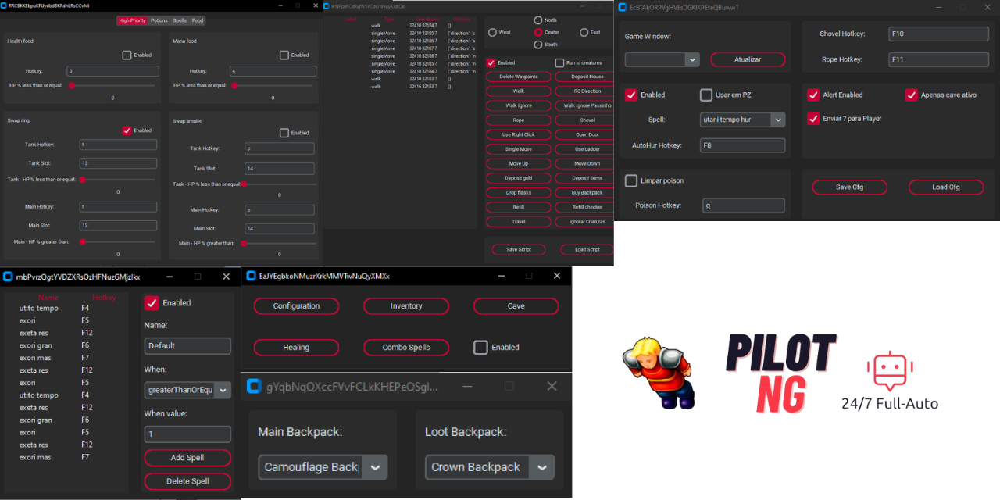
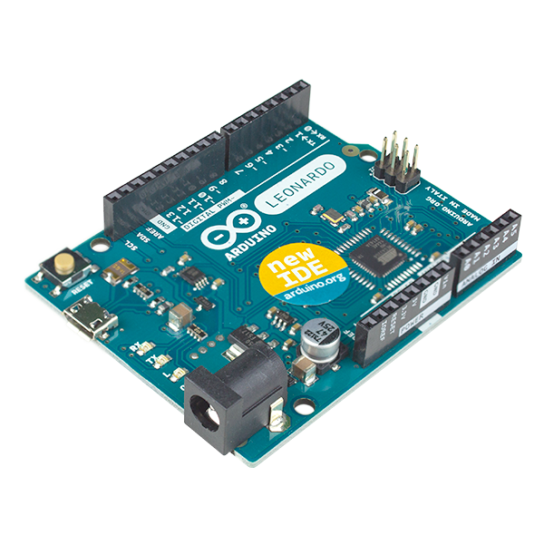

# 👑 Tibia PilotNG 👑

🤖 The most advanced 24/7 Full-Auto PixelBot for Tibia with Cavebot, Refiller, Depositer and more.


## 📖 A brief history

I started working on this bot in December 2023, I added all the necessary features to make it operational 24/7, which was active until today when I decided to stop the operation and publish my work and tell the experience of what it was like to have a tibia bot farm in 2024, I had 7 chars and 3 pcs, each char farmed an average of 10-11kk a day resulting in an average turnover of 30kk a day, on servers I played I dominated the minocults spot, placing bots on all floors, players gave up farming and dominant guilds didn't care. I hope you make the most of this bot, it's still 100% functional until the day I publish this source.

Below I'll leave some images and videos of how it worked, prints of the bot's UI, and how to install and run it.

## 📷 Gallery



### [You can see videos of it working on my Youtube channel](https://www.youtube.com/channel/UC4uyI035S2h0z862wpYVqXA)

## 📝 CAVEBOT SCRIPTS (SEE SCRIPTS FOLDER)

- DRAKEN WALLS NORTH ✔️
- MINOTAUR CULT -1 AND -2 ✔️

## 🟢 Features

- WORKS ON TIBIA GLOBAL ✔️
- 100% FULL AUTO ✔️
- CAVEBOT WITH WAYPOINTS (COORDINATES NOT CLICKMAP) ✔️
- SAVE AND SHARE CAVEBOT SCRIPTS ✔️
- CONFIGURABLE HOTKEYS ✔️
- CAITING CREATURES OVER BOXES ✔️
- OPEN DOORS, TRAVEL, CLICK ON BOATS ✔️
- IGNORE CREATURES ✔️
- DROP LOOT ON THE GROUND ✔️
- REFILER ✔️
- DEPOSITER ✔️
- WALK OVER THE FIRE ✔️
- ALERTS ✔️
- AUTO AMULET/RING ✔️
- COMBO SPELLS ✔️
- DROP FLASKS ✔️
- DEPOSIT GOLD ✔️
- DEPOSIT ITEMS ✔️
- FOOD EATER ✔️
- TARGETING ✔️
- HEALING ✔️
- QUICK LOOTING ✔️
- DEFAULT MESSAGE WHEN SEE A PLAYER ON THE SCREEN ✔️
- AUTO HUR ✔️
- AUTO CURE POISON ✔️
- FOLLOW ENEMY OR GO TO BOX TO KILL MONSTERS (DEPENDS THE CHAR LEVEL) ✔️

## 🔴 HARDWARE REQUIREMENTS

This bot needs good processing power to work properly (fast) i tested it with weak machines and didn't succeed, of the 3 machines i had running bots they all had a ryzen 5 5600 (6 core/12 threads +- 3.5ghz), use an equal or superior processor (or you can also use a worse one but overclock it), in addition to less input detection I chose to use a leonardo arduino to simulate mouse and keyboard inputs, you need a leonardo arduino to use this bot, if you don't have one you can change the source manually to use pyautogui or derivatives, or use a driver, but note that this may result in easier detection, inside the source I will leave a . ino file with the arduino code, just send it to your arduino leonardo and it will work (remember to leave the arduino as the standard COM33 port, otherwise the bot will not work), I also recommend spoofing the arduino (it's not necessary to run the project) so that it doesn't have the id of the arduino board but that of some input device (mouse/keyboard), thus making detection more difficult.



## 🔴 SOFTWARE REQUIREMENTS

THE BOT ONLY WORKS IN 1920X1080 RESOLUTION

TESTED ONLY ON WIN10

- [PYTHON 3.11.7](https://www.python.org/downloads/release/python-3117/)
- [POETRY](https://python-poetry.org/)
- [TESSERACT-WINDOWS](https://github.com/UB-Mannheim/tesseract/wiki)
- [VIRTUAL DISPLAY](https://www.amyuni.com/downloads/usbmmidd_v2.zip&v=ybHKFZjSkVY)
- [OBS](https://obsproject.com/pt-br/download)

COMMANDS TO ACTIVATE THE VIRTUAL DISPLAY:

- Extract the file, then:

```bash
cd C:\DIRECTORY\OF\EXTRACTED\FOLDER
deviceinstaller64 install usbmmidd.inf usbmmidd
```

-Add virtual display:

```bash
deviceinstaller64 enableidd 1
```

Once you have the second monitor activated, make sure your resolution is 1920x1080, then just open obs, add a game capture, select tibia and remove the pointer, then just open the game capture in windowed mode and click to maximise the window (windowed fullscreen)

OBS: If you have more than one physical screen, switch them all off and stick with just one

🔴 **IMPORTANT** YOU NEED TO REMOVE THE POINTER FROM THE OBS GAME CAPTURE, OTHERWISE IT MAY RESULT IN BUGS

⚠️ **OPTIONAL** IF YOU WANT, SPOOF THE VIRTUAL DISPLAY FOR LESS DETECTION

## 🔴 TIBIA CONFIG REQUIREMENTS

YOU NEED TO USE THIS CONFIGS IN YOUR CLIENT, OTHERWISE WILL NOT WORK


## ⚙️ HOW TO SETUP

🔴 USE AT YOUR OWN RISK

- DOWNLOAD AND INSTALL THE SOFTWARE DEPENDENCIES

- CLONE/DOWNLOAD THE PROJECT

- DOWNLOAD THE PYTHON DEPENDENCIES

```bash
poetry install
```

- RUN THE PROJECT

```bash
poetry run python main.py
```

## 🤝 Contributing

Contributions are always welcome! Create a pull request xD

## 💬 Lets talk

if you want to talk to me, add me on [**Linkedin**](https://br.linkedin.com/in/paulordyl) or [**Discord**](https://discord.gg/YzVhxzy4W6)

<a href="https://www.buymeacoffee.com/paulordyl" target="_blank"></a>


# ❤️ Acknowledgements

I started this project on the basis of the [**PyTibia**](https://github.com/lucasmonstrox/PyTibia) developed by [**lucasmonstrox**](https://github.com/lucasmonstrox), he did a great job, I was able to learn a lot from his project and the techniques he used, take a look at his project, he keeps updating it to this day.
