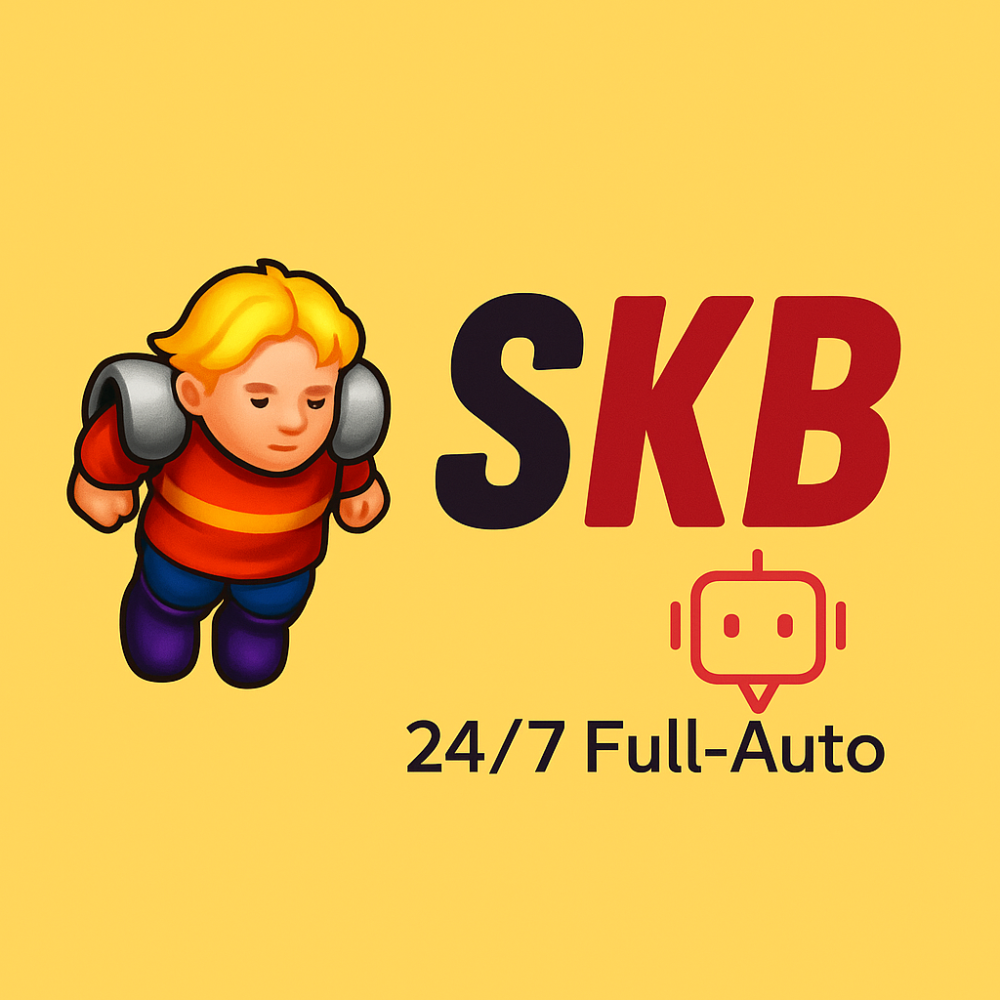

# 👑 Tibia PilotNG 👑

🤖 The most advanced 24/7 Full-Auto PixelBot for Tibia with Cavebot, Refiller, Depositer and more.



## 📖 A brief history

I started working on this bot in December 2023, I added all the necessary features to make it operational 24/7, which was active until today when I decided to stop the operation and publish my work and tell the experience of what it was like to have a tibia bot farm in 2024, I had 7 chars and 3 pcs, each char farmed an average of 10-11kk a day resulting in an average turnover of 30kk a day, on servers I played I dominated the minocults spot, placing bots on all floors, players gave up farming and dominant guilds didn't care. I hope you make the most of this bot, it's still 100% functional until the day I publish this source.

Below I'll leave some images and videos of how it worked, prints of the bot's UI, and how to install and run it.

## 📷 Gallery


### [You can see videos of it working on my Youtube channel](https://www.youtube.com/channel/UC4uyI035S2h0z862wpYVqXA)

## 📝 CAVEBOT SCRIPTS (SEE SCRIPTS FOLDER)

Cavebot scripts are JSON files (with a `.pilotscript` extension) that define a sequence of actions (waypoints) for the bot to follow. You can create and edit these scripts using the Cavebot tab in the application.

- DRAKEN WALLS NORTH ✔️
- MINOTAUR CULT -1 AND -2 ✔️

### Validating Your Scripts

The Cavebot page includes a **"Validate Script"** button. Clicking this will check your currently loaded script for common errors, such as:
-   Correct JSON formatting.
-   Ensuring each waypoint has all required fields (`label`, `type`, `coordinate`, `options`, `ignore`, `passinho`).
-   Using known waypoint `type` values.
-   Correct structure and values within the `options` field for each waypoint type.
-   Valid references for `waypointLabelToRedirect` in `refillChecker` waypoints.

This helps catch issues before you run the bot, saving time and preventing unexpected behavior.

### `.pilotscript` Reference Guide

Each waypoint in a script is a JSON object with the following base structure:

```json
{
    "label": "Descriptive Label (optional)",
    "type": "waypointTypeValue",
    "coordinate": [x, y, z],
    "options": {},
    "ignore": false,
    "passinho": false
}
```

-   `label` (string): An optional name for the waypoint (e.g., "Start Point", "Dragon Lair Entrance"). Used by `refillChecker`.
-   `type` (string): The type of action to perform. See below for valid types.
-   `coordinate` (array of 3 integers): The `[x, y, z]` map coordinate for the action.
-   `options` (object): A dictionary of options specific to the waypoint `type`.
-   `ignore` (boolean): If `true`, the bot attempts to ignore creatures while executing this waypoint (usually for `walk` type).
-   `passinho` (boolean): If `true`, uses a special movement mode (details may vary).

#### Waypoint Types and Their Options:

Below are the `KNOWN_WAYPOINT_TYPES` and the structure of their `options` object:

*   **`walk`**
    *   Purpose: Moves the character to the specified `coordinate`.
    *   `options`: `{}` (must be empty)

*   **`singleMove`**
    *   Purpose: Moves the character one step from the `coordinate` in a specified direction.
    *   `options`:
        *   `direction` (string): Required. Must be one of `"north"`, `"south"`, `"east"`, `"west"`, `"center"`.

*   **`rightClickDirection`**
    *   Purpose: Performs a right-click one step from the `coordinate` in a specified direction (e.g., to use a ladder down a hole where the hole itself is not walkable).
    *   `options`:
        *   `direction` (string): Required. Must be one of `"north"`, `"south"`, `"east"`, `"west"`, `"center"`.

*   **`useRope`**
    *   Purpose: Uses a rope on the specified `coordinate` (e.g., a rope spot).
    *   `options`: `{}` (must be empty)

*   **`useShovel`**
    *   Purpose: Uses a shovel on the specified `coordinate` (e.g., a hole or dirt patch).
    *   `options`: `{}` (must be empty)

*   **`rightClickUse`**
    *   Purpose: Performs a right-click directly on the `coordinate` (e.g., to open a chest or use an item).
    *   `options`: `{}` (must be empty)

*   **`openDoor`**
    *   Purpose: Attempts to open a door at the `coordinate`.
    *   `options`: `{}` (must be empty)

*   **`useLadder`**
    *   Purpose: Attempts to use a ladder at the `coordinate`.
    *   `options`: `{}` (must be empty)

*   **`moveUp`**
    *   Purpose: Moves the character up one floor (e.g., stairs, ladders, rope holes from below) from the `coordinate` in a specified on-screen direction.
    *   `options`:
        *   `direction` (string): Required. Must be one of `"north"`, `"south"`, `"east"`, `"west"`, `"center"`.

*   **`moveDown`**
    *   Purpose: Moves the character down one floor (e.g., stairs, holes, ladders from above) from the `coordinate` in a specified on-screen direction.
    *   `options`:
        *   `direction` (string): Required. Must be one of `"north"`, `"south"`, `"east"`, `"west"`, `"center"`.

*   **`depositGold`**
    *   Purpose: Initiates the gold deposit process (assumes NPC/bank is open).
    *   `options`: `{}` (must be empty)

*   **`depositItems`**
    *   Purpose: Opens the depot in a specified city and deposits items.
    *   `options`:
        *   `city` (string): Required. The name of the city where the depot is located. Valid cities include: `"AbDendriel"`, `"Ankrahmun"`, `"Carlin"`, `"Darashia"`, `"Edron"`, `"Farmine"`, `"Issavi"`, `"Kazoordon"`, `"LibertBay"`, `"PortHope"`, `"Rathleton"`, `"Svargrond"`, `"Thais"`, `"Venore"`, `"Yalahar"`, `"Feyrist"`, `"Dark Mansion"`.

*   **`depositItemsHouse`**
    *   Purpose: Deposits items into a house chest (assumes chest is open or accessible).
    *   `options`: `{}` (can be empty)
        *   `city` (string): Optional. If specified, must be a valid city name (see `depositItems` for list). This might be used for specific house deposit logic if implemented.

*   **`dropFlasks`**
    *   Purpose: Drops empty flasks.
    *   `options`: `{}` (must be empty)

*   **`travel`**
    *   Purpose: Initiates NPC travel to a specified city.
    *   `options`:
        *   `city` (string): Required. The destination city or travel keyword. Valid values include: `"AbDendriel"`, `"Ankrahmun"`, `"Carlin"`, `"Darashia"`, `"Edron"`, `"Farmine"`, `"Issavi"`, `"Kazoordon"`, `"LibertBay"`, `"PortHope"`, `"Rathleton"`, `"Svargrond"`, `"Thais"`, `"Venore"`, `"Yalahar"`, `"Tibia"`, `"Peg Leg"`, `"shortcut"`.

*   **`refill`**
    *   Purpose: Buys potions from an NPC.
    *   `options`:
        *   `healthPotionEnabled` (boolean): Required. Set to `true` if health potions should be refilled.
        *   `houseNpcEnabled` (boolean): Required. Set to `true` if refilling from a house NPC (changes dialog keyword).
        *   `healthPotion` (object): Required.
            *   `item` (string): Required. Name of the health potion. Valid names include: `"Health Potion"`, `"Strong Health Potion"`, `"Great Health Potion"`, `"Ultimate Health Potion"`, `"Supreme Health Potion"`, `"Great Spirit Potion"`, `"Ultimate Spirit Potion"`.
            *   `quantity` (integer): Required. Desired total quantity of this potion.
        *   `manaPotion` (object): Required.
            *   `item` (string): Required. Name of the mana potion. Valid names include: `"Mana Potion"`, `"Strong Mana Potion"`, `"Great Mana Potion"`, `"Ultimate Mana Potion"`, `"Great Spirit Potion"`, `"Ultimate Spirit Potion"`.
            *   `quantity` (integer): Required. Desired total quantity of this potion.

*   **`buyBackpack`**
    *   Purpose: Buys backpacks from an NPC.
    *   `options`:
        *   `name` (string): Required. Name of the backpack. Valid names: `"Orange Backpack"`, `"Red Backpack"`, `"Parcel"`.
        *   `amount` (integer): Required. Number of backpacks to buy.

*   **`refillChecker`**
    *   Purpose: Checks supply levels (potions, capacity) and redirects to another labeled waypoint if below thresholds.
    *   `options`:
        *   `minimumAmountOfHealthPotions` (integer): Required. Bot goes to refill if health potions are below this.
        *   `minimumAmountOfManaPotions` (integer): Required. Bot goes to refill if mana potions are below this.
        *   `minimumAmountOfCap` (integer): Required. Bot goes to refill if capacity is below this.
        *   `waypointLabelToRedirect` (string): Required. The `label` of the waypoint to go to if refill is needed. This label must exist elsewhere in the script.
        *   `healthEnabled` (boolean): Required. Set to `true` if health potion count should be considered in the check.

## 🟢 Features

- WORKS ON TIBIA GLOBAL ✔️
- 100% FULL AUTO ✔️
- CAVEBOT WITH WAYPOINTS (COORDINATES NOT CLICKMAP) ✔️
- SAVE AND SHARE CAVEBOT SCRIPTS ✔️
- CONFIGURABLE HOTKEYS ✔️
- CAITING CREATURES OVER BOXES ✔️
- OPEN DOORS, TRAVEL, CLICK ON BOATS ✔️
- IGNORE CREATURES ✔️
- DROP LOOT ON THE GROUND ✔️
- REFILER ✔️
- DEPOSITER ✔️
- WALK OVER THE FIRE ✔️
- ALERTS ✔️
- AUTO AMULET/RING ✔️
- COMBO SPELLS ✔️
- DROP FLASKS ✔️
- DEPOSIT GOLD ✔️
- DEPOSIT ITEMS ✔️
- FOOD EATER ✔️
- TARGETING ✔️
- HEALING ✔️
- QUICK LOOTING ✔️
- DEFAULT MESSAGE WHEN SEE A PLAYER ON THE SCREEN ✔️
- AUTO HUR ✔️
- AUTO CURE POISON ✔️
- FOLLOW ENEMY OR GO TO BOX TO KILL MONSTERS (DEPENDS THE CHAR LEVEL) ✔️

## 🔴 HARDWARE REQUIREMENTS

This bot needs good processing power to work properly (fast) i tested it with weak machines and didn't succeed, of the 3 machines i had running bots they all had a ryzen 5 5600 (6 core/12 threads +- 3.5ghz), use an equal or superior processor (or you can also use a worse one but overclock it), in addition to less input detection I chose to use a leonardo arduino to simulate mouse and keyboard inputs, you need a leonardo arduino to use this bot, if you don't have one you can change the source manually to use pyautogui or derivatives, or use a driver, but note that this may result in easier detection, inside the source I will leave a . ino file with the arduino code, just send it to your arduino leonardo and it will work (remember to leave the arduino as the standard COM33 port, otherwise the bot will not work), I also recommend spoofing the arduino (it's not necessary to run the project) so that it doesn't have the id of the arduino board but that of some input device (mouse/keyboard), thus making detection more difficult.


## 🔴 SOFTWARE REQUIREMENTS

THE BOT ONLY WORKS IN 1920X1080 RESOLUTION

TESTED ONLY ON WIN10

- [PYTHON 3.11.7](https://www.python.org/downloads/release/python-3117/)
- [POETRY](https://python-poetry.org/)
- [TESSERACT-WINDOWS](https://github.com/UB-Mannheim/tesseract/wiki)
- [VIRTUAL DISPLAY](https://www.amyuni.com/downloads/usbmmidd_v2.zip&v=ybHKFZjSkVY)
- [OBS](https://obsproject.com/pt-br/download)

COMMANDS TO ACTIVATE THE VIRTUAL DISPLAY:

- Extract the file, then:

```bash
cd C:\DIRECTORY\OF\EXTRACTED\FOLDER
deviceinstaller64 install usbmmidd.inf usbmmidd
```

-Add virtual display:

```bash
deviceinstaller64 enableidd 1
```

Once you have the second monitor activated, make sure your resolution is 1920x1080, then just open obs, add a game capture, select tibia and remove the pointer, then just open the game capture in windowed mode and click to maximise the window (windowed fullscreen)

OBS: If you have more than one physical screen, switch them all off and stick with just one

🔴 **IMPORTANT** YOU NEED TO REMOVE THE POINTER FROM THE OBS GAME CAPTURE, OTHERWISE IT MAY RESULT IN BUGS

⚠️ **OPTIONAL** IF YOU WANT, SPOOF THE VIRTUAL DISPLAY FOR LESS DETECTION

## 🔴 TIBIA CONFIG REQUIREMENTS

YOU NEED TO USE THIS CONFIGS IN YOUR CLIENT, OTHERWISE WILL NOT WORK


## ⚙️ Configuration

Tibia PilotNG settings are managed through a user-friendly interface within the application.

**Accessing Settings:**
To change application settings, click the **"Configuration"** button on the main application window. This will open the Settings Page.

**Using the Settings Page:**
The Settings Page allows you to customize various aspects of the bot, such as:
-   General application behavior (e.g., profile path, game resolution).
-   In-game item names (e.g., backpack names).
-   Gameplay mechanics and combat thresholds.
-   Hotkeys for all actions.
-   NPC interaction keywords and refill timings.
-   Keyboard and action delays.
-   Default values for UI elements.

Navigate through the categories on the left sidebar and adjust the settings in the main area. Once you've made your changes, click **"Save Settings"**. Some settings may require an application restart to take full effect.

**Configuration Files:**
Your customized settings are saved in a file named `config.json`, located in the root directory of the application (where the `pilotng` executable or `main.py` is).

-   **`config.json`**: Stores your personalized settings. While you can technically edit this file manually, it is **highly recommended to use the in-app Settings Page** to avoid errors.
-   **`config.default.json`**: This file is included with the application and serves as a template containing all default values. If `config.json` is missing or deleted, the application will use the values from `config.default.json` on the next run. You can also refer to this file to see the default state of all settings. The **"Reset to Defaults"** button on the Settings Page effectively reverts the settings in `config.json` (or your current session if not yet saved) back to these defaults.
-   **Internal Defaults**: If both `config.json` and `config.default.json` are missing, the application will fall back to a set of internal, hardcoded defaults.

To start with a fresh set of default configurations that you can customize, you can:
1.  Ensure no `config.json` exists in the root directory.
2.  The application will then use `config.default.json` (or internal defaults if it's also missing).
3.  Open the Settings Page, make any desired changes, and click "Save Settings". This will create a new `config.json` with your choices.

## ⚙️ HOW TO SETUP

🔴 USE AT YOUR OWN RISK

- DOWNLOAD AND INSTALL THE SOFTWARE DEPENDENCIES

- MAKE SURE THE ARDUINO IS PLUGGED IN

- CLONE/DOWNLOAD THE PROJECT

- DOWNLOAD THE PYTHON DEPENDENCIES

```bash
poetry install
```

- RUN THE PROJECT

```bash
poetry run python main.py
```

## 📦 Running from Executable

Alternatively, you can build and run the application from a standalone executable.

### Building the Executable

1.  Ensure you have all development dependencies installed:
    ```bash
    poetry install
    ```
2.  Run PyInstaller to build the executable using the provided spec file:
    ```bash
    poetry run pyinstaller pilotng.spec
    ```
    This command will create a `dist` folder in the root of the project, containing the executable and its associated files.

### Running the Executable

-   **On Linux:**
    Open your terminal, navigate to the project's root directory, and run:
    ```bash
    dist/pilotng
    ```
-   **On Windows:**
    Open Command Prompt or PowerShell, navigate to the project's root directory, and run:
    ```bash
    dist\pilotng.exe
    ```

## 🤝 Contributing

Contributions are always welcome! Create a pull request xD

## 💬 Lets talk

if you want to talk to me, add me on [**Linkedin**](https://br.linkedin.com/in/paulordyl) or [**Discord**](https://discord.gg/YzVhxzy4W6)

<a href="https://www.buymeacoffee.com/paulordyl" target="_blank"></a>


# ❤️ Acknowledgements

I started this project on the basis of the [**PyTibia**](https://github.com/lucasmonstrox/PyTibia) developed by [**lucasmonstrox**](https://github.com/lucasmonstrox), he did a great job, I was able to learn a lot from his project and the techniques he used, take a look at his project, he keeps updating it to this day.
